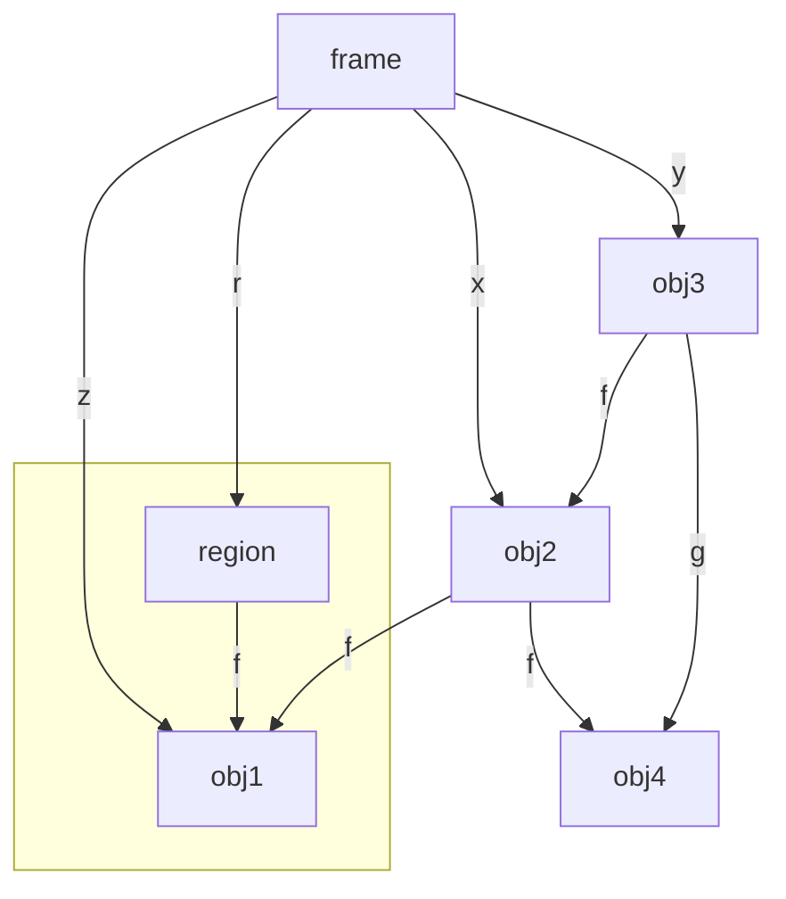
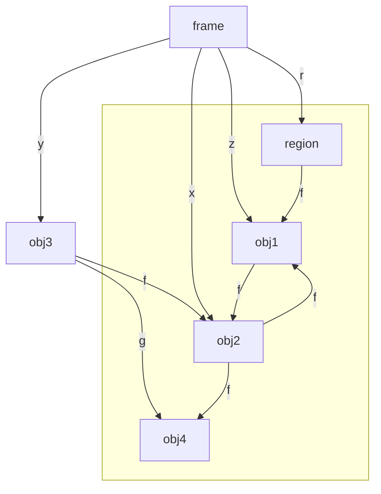

# DRAFT: Veronapy Regions

This document discusses the design of adding regions to Python 3.12 by modifying the runtime.


## Understanding Python's variables

Before we can discuss regions, we need to understand how Python handles variables.
The Python interpreter uses a stack to store local variables.
When a function is called, a new frame is created and pushed onto the stack.
However, there are a few subtleties to how Python handles variables that we need to understand:

* [Closures]
* [`locals()`]
* [Frame objects]

If you are familiar with Python's variable handling, you can skip this section.


### Closures

In Python, the `def` keyword creates a function object.
When a function is created, it captures the variables in the scope it is created in.
This is called a closure.

```python
def closure1():
  x = 1
  def inner():
    return x
  x = 2
  return inner()
```
Here, the function `inner` captures the variable `x` from the outer scope.
When `inner` is called, it returns the value of `x` from the scope it was created in.
This is captured by reference.
That is the update, `x = 2`, is visible to inner, and the value returned is `2`.

Captures are not allowed to be modified unless it is explicitly declared as `nonlocal`.
This allows us to write code that encapsulates state
```python
def closure2():
  x = 1
  def inc():
    nonlocal x
    x += 1
    return x
  return inc
```
This returns a function object that each time it is called increments the value of `x` by one.
```python
>>> f = closure2()
>>> f()
2
>>> f()
3
```

Closures are a powerful feature of Python that allow us to write code that encapsulates state.
The state that they capture can be shared between multiple function objects:
```python
def closure3():
  x = 1
  def inc():
    nonlocal x
    x += 1
    return x
  def dec():
    nonlocal x
    x -= 1
    return x
  return inc, dec
```
This returns a tuple of two function objects that share the same state.
The first function increments the value of `x`, and the second decrements it.
```python
>>> inc, dec = closure3()
>>> inc()
2
>>> dec()
1
```

Under the hood in the CPython implementation, closures are implemented using a `Cell` object.
A `Cell` object is a simple object that contains a single field.
When a closure is created, the variables that are captured are stored in `Cell` objects.

```Python
>>>  inc.__closure__
(<cell at 0x7ea265cdb490: int object at 0x7ea268160110>,)
>>>  dec.__closure__
(<cell at 0x7ea265cdb490: int object at 0x7ea268160110>,)
```
Here we can see that the two function objects have closed over the same `cell` object.

The Python interpreter conducts a free variable analysis and decides if a variable is used in a function object,
and if such it creates a `Cell` object to store the value of the variable.


### `locals()`

In Python, it is possible to create an object that contains all the local variables in the current scope.

```python
def locals_example1():
  x = 1
  l = locals()
  return l
```
This function returns a dictionary object that contains all the local variables in the current scope.
```python
>>> locals_example1()
{'x': 1}
```

The `locals()` function returns a dictionary object that contains all the local variables in the current scope.
This dictionary object is a snapshot of the local variables at the time the function is called.
It is not a live view of the local variables.
```python
def locals_example2():
  x = 1
  l = locals()
  x = 2
  return l
```
Calling this function the returned dictionary does not account for the update to `x`.
```python
>>> locals_example2()
{'x': 1}
```

The `locals()` function also captures the local variables in the enclosing scope.
```python
def locals_example3():
  x = 1
  y = 2
  def inner():
    t = x
    return locals()
  return inner()
```
This returns a dictionary object that contains the local variables in the enclosing scope that have been mentioned.
```python
>>> locals_example3()
{'t': 1, 'x': 1}
```
The variable `x` has been captured by the `locals()` function,
but `y` has not been mentioned in the inner function, and thus is not captured.

The capture is also nested. 
```python
def locals_example4():
  x = 1
  y = 2
  def inner():
    def inner_inner():
      t = x
    return locals()
  return inner()
```
Here the dictionary returned `locals` contains the function object `inner_inner` and `x`.
Although, `inner` does not directly use `x`, it is captured by `inner_inner` and thus is included in the dictionary.
The `t` used in `inner_inner` is not captured as it is in an inner scope.
```python
>>> locals_example4()
{'inner_inner': <function locals_example4.<locals>.inner.<locals>.inner_inner at 0x7ea265d3add0>, 'x': 1}
```

The `locals()` function does not store the `cell` for closures in the dictionary.
```python
def locals_example5():
  x = 1
  def inc():
    nonlocal x
    x += 1
    return x
  return locals()
```
If we access the dictionary, the function object `inc` is stored, but the `cell` object is not.
The original value of the variable `x` is stored in the dictionary.
```python
>>> d = locals_example5()
>>> d["x"]
1
>>> d["inc"]()
2
>>> d["inc"]()
3
>>> d["x"]
1
```


### Frame objects

The `locals()` call provides a snapshot of the local variables in the current scope.
However, it does not provide access to the frame object itself.
The frame object is a Python object that represents the current execution context.

The primary purpose is for debugging.
The frame object is often used to be able to give a more comprehensive error/log message.
This can involve potentially stack traces, or the local variables at the time of the error.

The frame object contains a reference to the code object that is being executed.
It also contains a reference to the global and local variables.
Python programs can use this object to access the local and global variables.
This object is updated in sync with the underlying variables:

```python
def frame_example1():
  x = 1
  l = sys._getframe()
  x = 2
  return l.f_locals
```
This behaves differently to `locals` and captures the update to `x`.
```python
>>> f = frame_example1()
>>> f
{'x': 2, 'l': <frame at 0x7ea265e76f60, file '<stdin>', line 5, code frame_example1>}
```
Interesting, it also contains `l` which is the frame object itself.

Storing the frame object in a variable will cause a reference cycle:
```python
>>> f["l"].f_locals
{'x': 2, 'l': <frame at 0x7ea265e76f60, file '<stdin>', line 5, code frame_example1>}
>>> f["l"].f_locals["l"].f_locals
{'x': 2, 'l': <frame at 0x7ea265e76f60, file '<stdin>', line 5, code frame_example1>}
```

This is not the case for `locals()`, which does not capture the dictionary it creates:
```python
def frame_example2():
  x = 1
  l = locals()
  x = 2
  return l
```
This is because the assignment to `l` occurs after the call to `locals()`,
and hence the dictionary does not contain the variable `l`.

There was an interesting example in [numpy](https://github.com/numpy/numpy/blob/e1bf1d635016a0118f7d77bf8931071a2c74ad20/numpy/matrixlib/defmatrix.py#L1095) that uses the context to affect the evaluation of an expression.
Here we present the idea as a reverse polish evaluator.
```python
>>> x = 1
>>> y = 2
>>> calc("4 x y + *")
```
The idea is to interpolate the `x` and `y` into the string while evaluating it.
```
def calc(str):
  ctxt = sys._getframe().f_back
  ops = str.split()
  stack = []
  for op in ops:
    try: 
      stack.append(int(op))
    except ValueError:
      if op == "+":
        stack.append(stack.pop() + stack.pop())
      elif op == "*":
        stack.append(stack.pop() * stack.pop())
      else:    
        stack.append(ctxt.f_locals[op])      
  return stack.pop()
```
This is a simple example, but it shows how the frame object can be used to access the local variables in the calling scope.
```
>>> x = 1
>>> y = 2
>>> calc("4 x y + *")
12
```

The numpy library is pretty popular, so this is a good example of how to use the frame object in a way that is not debugging.


Note that the frame object is mostly read-only, but does contain an interesting operation to set the executing line number of a frame.
```C
static int
frame_setlineno(PyFrameObject *f, PyObject* p_new_lineno, void *Py_UNUSED(ignored))
```
This seems very bad to call from another thread/interpreter.

Ultimately, a frame object should never escape the thread/interpreter that it was created in.


## Regions in Veronapy.

The previous section illustrates the many temporary objects that Python creates to handle variables.
To support this, we need our region object model to support complex local structures for indexing into regions.
To achieve this, we will use three kinds of object ownership:

* Interpreter Local object 
* Regions
* Immutable

The "local objects" are used to represent the many local structures that Python creates that are mutable and not shared between interpreters.
Examples of "local objects" are
the frame objects and cells that represent the local variables;
the function objects while they are still mutable;
and any object that does not need to be used by another interpreter.

If an object needs to be accessed by another interpreter then there are two options: "regions" or "immutable".
Immutable objects can be freely shared between interpreters, but they cannot be modified.
In Veronapy, immutable is deep, that is anything reachable from an immutable object is also immutable.

To pass mutable states between interpreters, we need to introduce a new construct to Python: "regions".
A region is a group of objects that can move together across interpreters
and can be accessed by at most one interpreter at a time.
This removes the need for locks to protect the objects in the region.
The region can be passed between interpreters, and the receiving interpreter can access the objects in the region.

To efficiently support regions, we impose the following invariants that the runtime is responsible for maintaining:

* Local objects can reach anything
* Immutable objects can only reach other immutable objects.
* Objects in a region can only reach other objects in the same region, immutable objects, or linear region entry points.
* Regions track the number of incoming references from local objects.

New objects are always created as a local object,
and can be transition to regions or immutable objects after creation.
If Veronapy features are not used, then all the objects in the system will be local objects and the runtime will behave as normal.


### Regions

Regions are used to pass mutable state between concurrent units of execution (behaviours).
For usability, we need references into the region, that are not part of the region itself.
These might be from the objects such as the frame, from closures or from function objects.
This is precisely what local objects are for as they can refer into the region.

The core challenge is allowing local objects to refer into a region,
while allowing the region to be sent to another interpreter.
To do this, we need to track the number of references from local objects to a region, the "local reference count" (LRC).
There is a single LRC for each region, and it is updated as objects are promoted into the region or references are removed.

When we send a region to another behaviour we need to ensure that the LRC is zero.
To make this more usable, if the LRC is not zero, we can scan the current frame to find all references to the region, and remove them.
This removal could involve a special type `Dangle` that is used to represent a reference that is no longer valid.
Debugging information could be collected to help identify when the reference was `Dangle`d.
If there are still references, then we can scan all objects (from the existing doubly-linked list in the Python cycle detector) to find a reference,
and report that as an error.

If a reference occurs from a Python immutable type like tuple, then this will lead to an error.
We cannot mutate the tuple, so we must fail the operation, or make the tuple go away.

When a local object becomes reachable from a region, we need to promote it and anything it can reach to be part of that region.
When we promote the local object we need to modify the LRC of the region.
This involves adding new counts for reference to the newly added objects, and removing counts for edges that have become internal to the region.
Consider the following example:

```python
x = {}
#  x is a field of the frame object, which is local. 
#  it points at a fresh dictionary object, which is also local.
y = {}
#  y is a field of the frame object, which is local. 
#  it points at a fresh dictionary object, which is also local.
x.f = y
# x.f is a field of the dictionary object, which is local.
# y is also local so no need to do anything in the write barrier.

# Create a fresh region
r = Region()
# r is an region
r.f = y
# r.f is a field of the region object, which is in that region.
# y was local, so we need to promote y to the region, r.
# Before the assignment y has an RC of 2: One from the frame object, one from the object pointed to be x.
# This adds two local RCs to the region.
y = None
# This reduces the localRC on r, by one. 
x = None
# This causes the old value of x to be collected
# This in turn reduces the localRC on r by one as it clears the f field that points into the region.

# We can now send the region r. It only has a single local RC r, and the operation will cause the 
# local frame to clear that reference.
send(r)
# r is None at this point
```

> [Note that `send` is a placeholder operation that will be turned into proper concurrency support later.
 It represents any operation that should prevent the region from being accessed by the current interpreter.]


To re-establish the correct local reference count, we calculate the updates to LRC as follows.
First we calculate the set of local objects, L, that are being made reachable from this region.
As the set L is only reachable by local objects, we know that its reference count is purely from local objects.  
Thus, we calculate sum of all the rcs in L, called R.
Some of these references are internal to the set L,
and one is from the region itself,
so we calculate the number of references from L to L, called I.
Thus, we have created R-I-1 additional references into the region.
However, L can also reach into the region, so we calculate the number of references from L to the region, C.
Thus, we need to increase the region's local reference count by R - I - 1, and then subtract C from it.
This re-establishes the invariant.

To illustrate this, consider the following object graph:

Now consider executing the following code:
```python
z.f = x
```
This creates a link from `obj1` to `obj2`.
The updated object graph is below:


The local reference count for the `region` is modified in the following way.
* The reference count for `obj2` is increased by 1 to represent the new reference from `obj1`.
* The objects `obj2` and `obj4` are added to the region, they have a combined reference count of 5.
* The edge from `obj2` to `obj4` is considered internal, so we reduce the LRC by one.
* The edge from `obj2` to `obj1` is considered internal, so we reduce the LRC by one.
* The edge from `obj1` to `obj2` is considered internal, so we reduce the LRC by one.

Thus, the resulting change is to increase the LRC by 5, and then reduce it by 3. 


### Immutable objects

To share objects between behaviours, we need to ensure that the object is not mutated.
This is achieved by making the object "deeply immutable".
This means that the object and all objects reachable from it are also immutable.

To support this, we need an operation to turn initially mutable objects into immutable objects.
We extend the programming model with a `freeze` operation that makes an object and its reachable graph of objects immutable.

> Note: we may decide to restrict the usage of `freeze` to regions and types only.
> Initially, we will be flexible to see how the programming model works.

The fields of an immutable object may not be modified.
Its reference count can be modified, and it can be collected if it is no longer referenced.
This reference count may be concurrently modified.

To allow globals to be used in a concurrent setting, we add an explicit operation to make the globals immutable for synchronous access (We will add asynchronously accessible globals in another document.).
```
make_globals_immutable()
```
This must have been run to start the concurrency runtime and enable region creation.
This cannot be immediately done as we need some time to allow for the set-up of the types and any monkey-patching.
As types are globals, you would not be able to have any fields on Types (for example default values) if they are immutable from the start.

We do not expect the `make_globals_immutable()` operation to be exposed to the programmer directly, but to be called as needed by the runtime.
Exposing it in the prototype is useful for testing and debugging.


## Project plan

We need to break the development in to several phases and their completion requirements.


### Phase 1: Deeply immutable objects

*  A flag to represent if an object is deeply immutable.
*  If the flag is set, then the object cannot be mutated.  (This needs to be enforced in the runtime.)
*  Any object reachable from a deeply immutable object is also deeply immutable.
*  A `freeze` operation that makes an object and its reachable graph of objects deeply immutable. 


### Phase 2: `make_globals_immutable`

A function that makes all global objects deeply immutable.


### Phase 3: Regions

* Adding a field to the object header to represent the region. 
  (Optimisations of this representation will be added in Phase 8, and the object size will be reduced.
  Using a single field initially keeps the prototype simple and easy to understand.)
* A new object type to represent regions.
* An operation to promote an object into a region.
* This requires tracking the number of references from local objects to a region (as described above) called the "local reference count", LRC.


### Phase 4: Maintaining region invariants

As the heap evolves, we need to detect changes and update the region status of objects.
To do this, we use a write-barrier that ensures the region's local reference count is maintained.

The following cases (that may overlap) need to be handled:

* Changing a reference from a "local object" from into a "region", then we need to remove a reference from the LRC.
* Changing a reference from a "local object" to point into a "region", then we need to add a reference to the LRC.
* Creating a reference from an object in a "region" to a "local object", then we need to promote the local object to also be in that region.
  This may fail if the local object can reach a different region. 


### Phase 5: Send/consume

Add an operation that represents sending a region to another interpreter.
This is a placeholder operation that will be turned into proper concurrency support later in Phase 7.

If the region still has a non-zero LRC, then we need to 

* scan the current frame to find all references to the region, and remove them.
* If there are still references, then scan all objects (from the cycle detector doubly linked list) to find a reference, and report that as an error.


### Phase 6: Memory management

The existing Python cycle detector in 3.12 uses a doubly linked list of objects effectively per interpreter.
This is not suitable once we have concurrency.
There are two cases to consider:

* Immutable objects, and 
* Regions.

For regions, we need to make each region contain its own doubly linked list, and then we can scan the doubly linked list for cycle detection.
When an object is promoted to a region, it can be moved from the interpreter's doubly linked list to the region's doubly linked list.

Immutable objects need to be shared between threads, but that precludes the use of the doubly linked list without incurring locks.
We have developed a new algorithm for reference counting immutable state using strongly connected components and union-find.
We need to implement this algorithm inside the Python runtime, and then perform reference counting for immutable objects at the level of the SCC.
This is fully documented and the code is available in the main Verona runtime repository: [https://github.com/microsoft/verona-rt/blob/main/src/rt/region/freeze.h](freeze.h).
The reference counts of immutable object need to be modified in a concurrency safe way with atomic instructions.


### Phase 7: Concurrency

Expose `when` and integrate with multiple interpreters.

Expose shared regions that can be contained in immutable state and accessed asynchronously with `when`.

Implement concurrency using multiple interpreters, one per hardware thread.


### Phase 8: More efficient region representation.

The changes so far have increased the memory overhead from 2 pointers per object for the doubly-linked-list to 3 pointers for the doubly-linked-list and region.
The final change is to reduce the memory overhead of the region system from 3 pointers to 1 pointer in the object header.

To achieve this, we will represent a region as a collection of blocks that each contain 
* a reference to the region object,
* a next and prev pointer to the next and previous block in the region, and
* a vector of N reverse pointer from the region to the objects in the region.

The representation can be used to replace the doubly linked list for tracking the objects contained in a region.
The representation is fractionally larger that the original two pointers.
Effectively 3/Nths of a pointer per object, where N is the number of objects in a block.
We can choose N to be large enough to make this neglible.

There are potential issues of fragmentation of a region's metadata, but we can compress the metadata if we detect that case.
Scanning the blocks should lead to good cache locality for the cycle detector.

We will need to use this representation for the per interpreter local objects too, that is, this would need to be an always on change.

## Conclusion

This document has outlined the design of adding regions to Python 3.12 by modifying the runtime.
The runtime will be modified to support deeply immutable objects, regions, and the ability to send regions between interpreters.
The runtime will also be modified to support concurrency, with multiple interpreters running on multiple threads.
The changes here are aimed at producing an artifact that can be used to evaluate the design and programming model.
